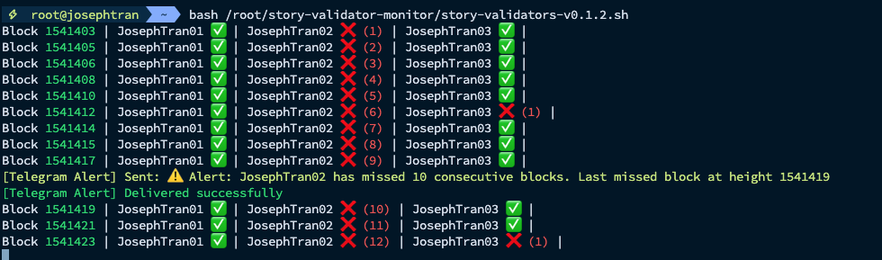

# Wave-2: story-validators-race


# Task4: Useful utility for validators
For Task 4, I have developed two useful utilities for Story blockchain validators:

1. Validator Monitor: A real-time monitoring tool with Telegram alerts
2. RPC Scanner: A comprehensive RPC endpoint scanner and vulnerability checker

Below are detailed instructions for each tool.

## I. Validator Monitor

### Description

This tool is a useful utility for Story blockchain validators, helping to monitor block signing status and send alerts via Telegram when a validator misses multiple consecutive blocks.



### Key Features

1. Monitor block signing status of multiple validators simultaneously.
2. Display the number of consecutive missed blocks for each validator.
3. Send alerts via Telegram when a validator misses multiple consecutive blocks (default is 10 blocks).
4. Display real-time results with color coding for easy reading.

## How to Use

### System Requirements

- Bash shell
- curl
- jq

### Installation
1. Clone the repository:
2. Configure Telegram Bot:
- Create a new Telegram Bot via BotFather.
- Get the bot token and your chat ID.
- Edit the script file, replace `YOUR_BOT_TOKEN` and `YOUR_CHAT_ID` with your information.

3. Configure validator list:
- Create a file `story_validators.txt` in the script directory.
- Each line in this file should contain a validator's address and name, separated by a space.
Example:
```
0C8E4B08F68CAC267823DA7B31A78AA370D8EE35 JosephTran01
E1689ACFE8E7A4E91AC502FA521FBBC145B4F5B8 JosephTran02
260D39E34031597A2CB19D834F5B12CC45AD20B6 JosephTran03
```
4. (Optional) Adjust parameters:
- Change `ALERT_THRESHOLD` if you want to adjust the number of consecutive missed blocks before sending an alert.
- Change `RPC_ENDPOINT` if you want to use a different RPC endpoint.

### Running the Script

```bash
bash story-validator-monitor.sh
```
The script will run continuously and display the status of validators every 5 seconds. If a validator misses consecutive blocks exceeding the alert threshold, you will receive a notification via Telegram.
Example Output:
```bash
⚡ root@josephtran  ~  bash /root/story-validator-monitor/story-validators-v0.1.2.sh
Block 1541403 | JosephTran01 ✅ | JosephTran02 ❌ (1) | JosephTran03 ✅ |
Block 1541405 | JosephTran01 ✅ | JosephTran02 ❌ (2) | JosephTran03 ✅ |
Block 1541406 | JosephTran01 ✅ | JosephTran02 ❌ (3) | JosephTran03 ✅ |
Block 1541408 | JosephTran01 ✅ | JosephTran02 ❌ (4) | JosephTran03 ✅ |
Block 1541410 | JosephTran01 ✅ | JosephTran02 ❌ (5) | JosephTran03 ✅ |
Block 1541412 | JosephTran01 ✅ | JosephTran02 ❌ (6) | JosephTran03 ❌ (1) |
Block 1541414 | JosephTran01 ✅ | JosephTran02 ❌ (7) | JosephTran03 ✅ |
Block 1541415 | JosephTran01 ✅ | JosephTran02 ❌ (8) | JosephTran03 ✅ |
Block 1541417 | JosephTran01 ✅ | JosephTran02 ❌ (9) | JosephTran03 ✅ |
[Telegram Alert] Sent: ⚠️  Alert: JosephTran02 has missed 10 consecutive blocks. Last missed block at height 1541419
[Telegram Alert] Delivered successfully
Block 1541419 | JosephTran01 ✅ | JosephTran02 ❌ (10) | JosephTran03 ✅ |
Block 1541421 | JosephTran01 ✅ | JosephTran02 ❌ (11) | JosephTran03 ✅ |
Block 1541423 | JosephTran01 ✅ | JosephTran02 ❌ (12) | JosephTran03 ❌ (1) |
```
